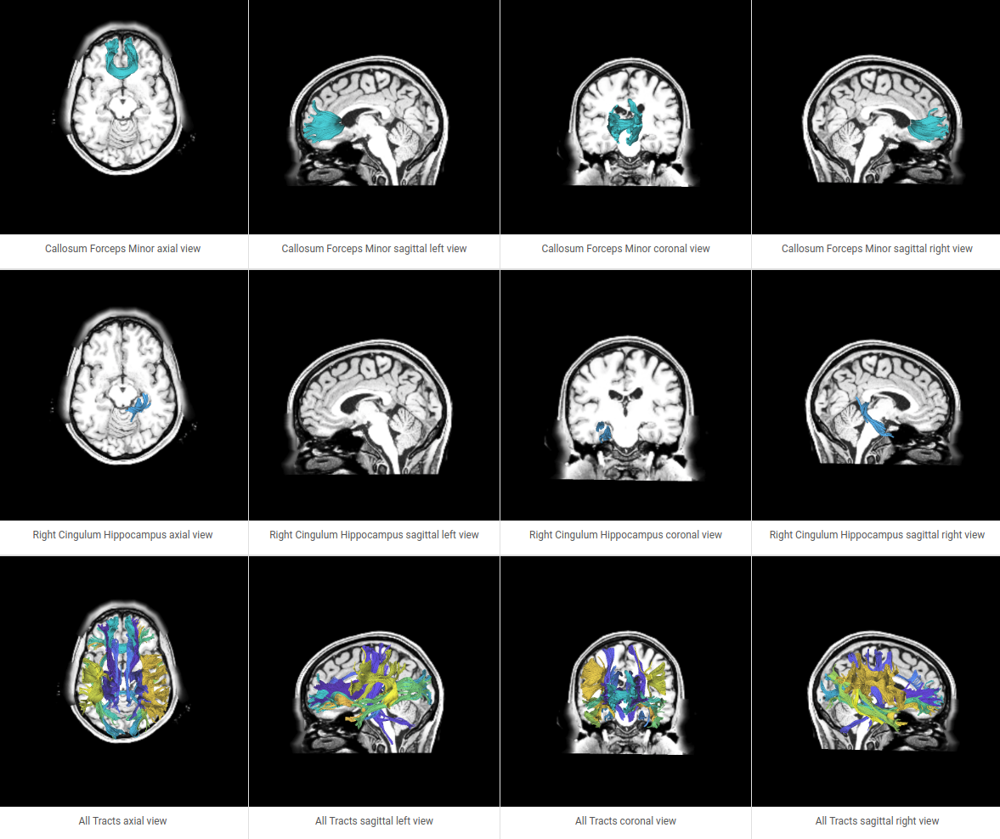

[](https://github.com/brain-life/abcd-spec)
[](https://doi.org/10.25663/brainlife.app.145)

# app-plotAFQ

This App plots the fibers outputted from app-tractclassification.



### Author
- Lindsey Kitchell (kitchell@indiana.edu)


### Funding 
[](https://nsf.gov/awardsearch/showAward?AWD_ID=1734853)
[](https://nsf.gov/awardsearch/showAward?AWD_ID=1636893)

## Running the App 

### On Brainlife.io

You can submit this App online at [https://brainlife.io/app/5967b45e81d7ef0021538e89](https://brainlife.io/app/5967b45e81d7ef0021538e89) via the "Execute" tab.

### Running Locally (on your machine)

1. git clone this repo.
2. Inside the cloned directory, create `config.json` with something like the following content with paths to your input files.

```json
{
    "coronal": 85,
    "sagittal": 74,
    "axial": 48,
    "AFQ": "testdata/track/tracts",
    "t1": "testdata/anat/t1.nii.gz",
    "img_max": 2,
    "img_min": -0.5
}
```
If you have singlarity install on your local machine:

3. Launch the App by executing `main`

### Sample Datasets

If you don't have your own input file, you can download sample datasets from Brainlife.io, or you can use [Brainlife CLI](https://github.com/brain-life/cli).

## Output

The output of this app will be a folder with images of the AFQ tracts.

### Dependencies

This App only requires [singularity](https://www.sylabs.io/singularity/) to run. If you don't have singularity, you will need to install following dependencies.  

```
RUN apt-get update && apt-get install -y python-pip
RUN apt-get install -y xvfb x11-xkb-utils
RUN apt-get install -y xfonts-100dpi xfonts-75dpi xfonts-scalable xfonts-cyrillic
RUN apt-get install -y python-matplotlib

RUN pip install numpy cython scipy h5py nibabel nipype
RUN pip install cvxpy scikit-learn
RUN pip install dipy joblib pandas nibabel

RUN pip install xvfbwrapper
RUN apt-get install -y python-vtk
```

