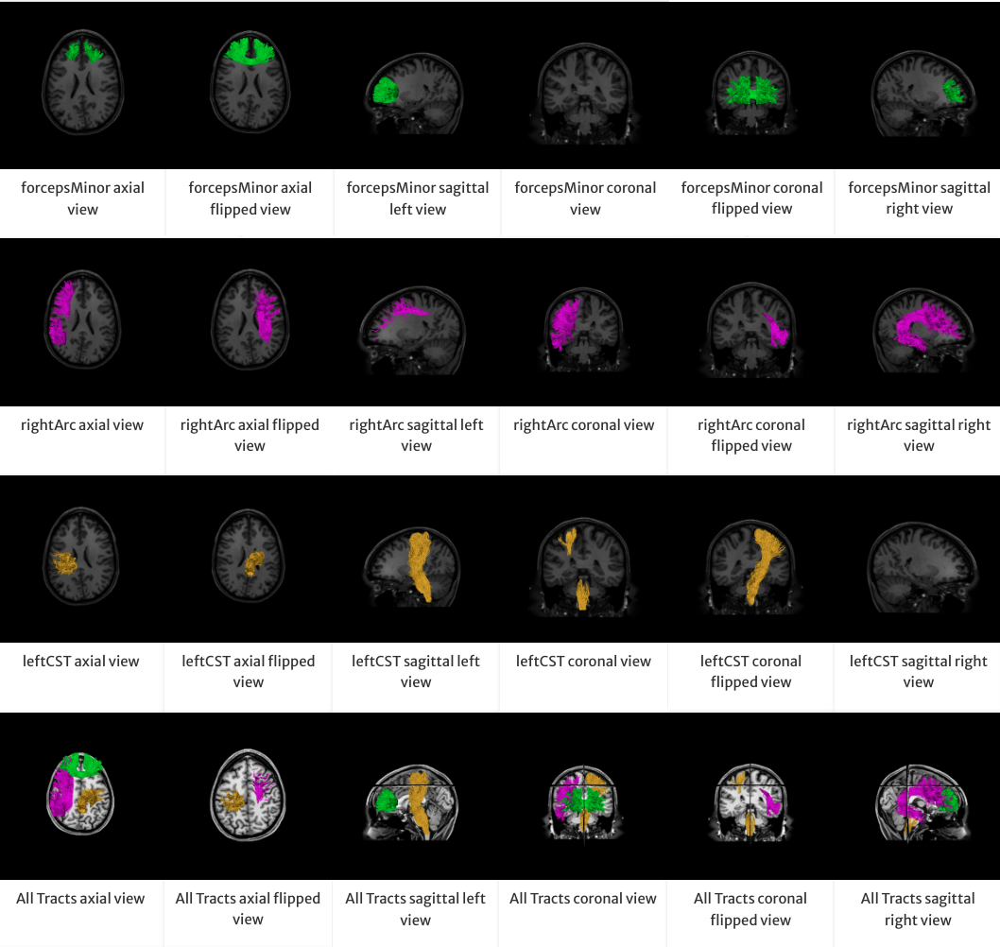

[](https://github.com/brain-life/abcd-spec)
[](https://doi.org/10.25663/brainlife.app.607)

# app-wmc_figures

This service creates 6 figures of each specified white matter tract (any wmc structure): axial, axial_flipped, sagittal_left, sagittal_right, coronal, and coronal_flipped. It also creates 6 figures containing all the tracts.

{:width="360px"}

### Authors
- Lindsey Kitchell (kitchell@indiana.edu)
- Brad Caron ([@bacaron](https://github.com/bacaron))
- Giulia Bertò ([@giulia-berto](https://github.com/giulia-berto))
- Anibal Sólon ([@anibalsolon](https://github.com/anibalsolon))

### Project director
- Franco Pestilli ([@francopestilli](https://github.com/francopestilli))

### Funding Acknowledgement
brainlife.io is publicly funded and for the sustainability of the project it is helpful to Acknowledge the use of the platform. We kindly ask that you acknowledge the funding below in your code and publications. Copy and past the following lines into your repository when using this code.

[](https://nsf.gov/awardsearch/showAward?AWD_ID=1734853)
[](https://nsf.gov/awardsearch/showAward?AWD_ID=1636893)
[](https://nsf.gov/awardsearch/showAward?AWD_ID=1916518)
[](https://nsf.gov/awardsearch/showAward?AWD_ID=1912270)
[](https://grantome.com/grant/NIH/R01-EB029272-01)

### Citations
We ask that you cite the following articles when publishing papers that used data, code or other resources created by the brainlife.io community.

1. Avesani, P., McPherson, B., Hayashi, S. et al. The open diffusion data derivatives, brain data upcycling via integrated publishing of derivatives and reproducible open cloud services. Sci Data 6, 69 (2019). [https://doi.org/10.1038/s41597-019-0073-y](https://doi.org/10.1038/s41597-019-0073-y)

## Running the App 

### On Brainlife.io

You can submit this App online at [https://brainlife.io/app/5967b45e81d7ef0021538e89](https://doi.org/10.25663/brainlife.app.607) via the "Execute" tab.

### Running Locally (on your machine)

1. git clone this repo.
2. Inside the cloned directory, create `config.json` with something like the following content with paths to your input files.

```json
{
    "coronal": 85,
    "sagittal": 74,
    "axial": 48,
    "wmc": "testdata/track/tracts",
    "t1": "testdata/anat/t1.nii.gz",
    "img_max": 2,
    "img_min": -0.5
}
```
If you have singularity installed on your local machine:

3. Launch the App by executing `main`.

### Inputs

You would need a White Matter Classification (WMC) structure and a T1w image to select the anatomical slices from. The default slices work well for the HCP t1 images if they have not been re-ACPC aligned. If you have ACPC aligned your t1 images using the ACPC alignment app on brainlife, the following values are a good starting point: coronal = 105, sagittal = 89, axial = 65. The img_min and img_max values refer to the value range displayed for the t1 image. The value range is calculated as follow (mean + img_min * std, mean + img_max * std). The default values are a good starting place, adjust them if your t1 is too dark or too light. \
If you only want images of a set of specified tracts (the default is to create the images of all the wmc tracts), you can specify their tract codes. For tract codes derived from common segmentations available on brainlife, please refer to the following links:
- AFQ (Yeatman, 2012): [tract_codes_AFQ](https://github.com/brainlife/app-wmc_figures/blob/master/TRACT_CODES_AFQ.md)
- TractSeg (Wasserthal, 2018): [tract_codes_tractseg](https://github.com/brainlife/app-wmc_figures/blob/master/TRACT_CODES_TRACTSEG.md)
- White Matter Anatomy Segmentation (Bullock et al, 2019): [tract_codes_wmaseg](https://github.com/brainlife/app-wmc_figures/blob/master/TRACT_CODES_WMASEG.md)

## Output

The output of this app will be a folder with images of the specified wmc tracts.

### Sample Datasets

If you don't have your own input file, you can download sample datasets from brainlife, or you can use [Brainlife CLI](https://github.com/brain-life/cli).

### Dependencies

This App only requires [singularity](https://www.sylabs.io/singularity/) to run. If you don't have singularity, you will need to install following dependencies.  

```
RUN apt-get update && apt-get install -y python-pip
RUN apt-get install -y xvfb x11-xkb-utils
RUN apt-get install -y xfonts-100dpi xfonts-75dpi xfonts-scalable xfonts-cyrillic
RUN apt-get install -y python-matplotlib

RUN pip install numpy cython scipy h5py nibabel nipype
RUN pip install cvxpy scikit-learn
RUN pip install dipy joblib pandas nibabel

RUN pip install xvfbwrapper
RUN apt-get install -y python-vtk
```

---

#### MIT Copyright (c) brainlife.io

<sub> This material is based upon work supported by the National Science Foundation Graduate Research Fellowship under Grant No. 1342962. Any opinion, findings, and conclusions or recommendations expressed in this material are those of the authors(s) and do not necessarily reflect the views of the National Science Foundation. </sub>
